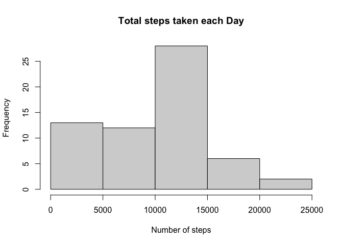
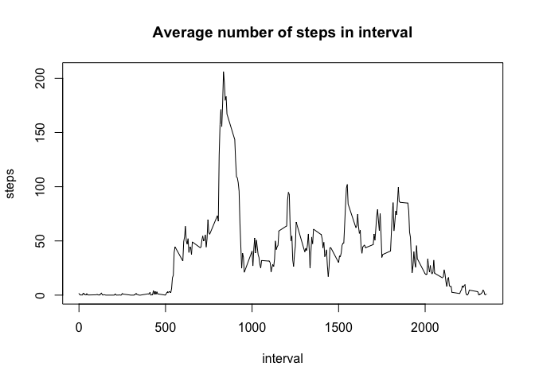
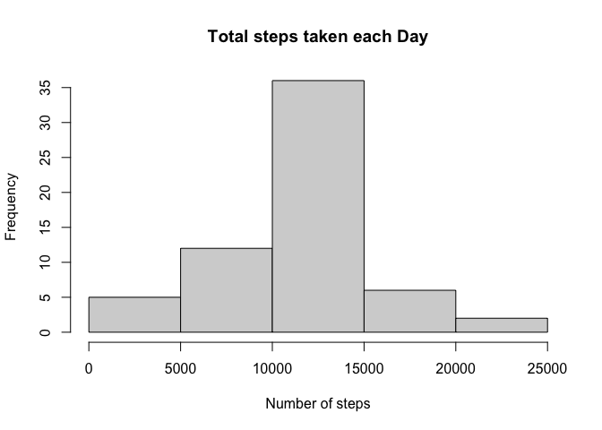
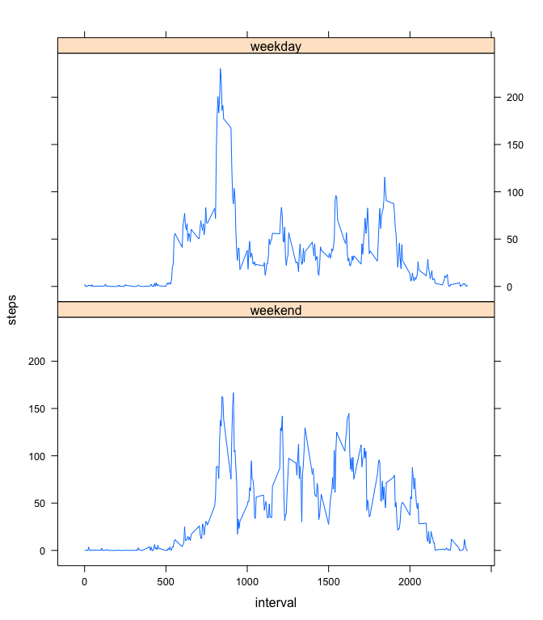

```r
library(knitr)
opts_chunk$set(echo = TRUE,cache=TRUE)
```

```r
library(dplyr)
library(lattice)
```
## Loading and preprocessing the data
1. loading the data from _"activity.zip"_ file :

```r
activity <- read.csv(unz("activity.zip","activity.csv"))
```

2. processing the data as required by us :    
  `date field is still as character lets make it Date class.`   

```r
activity$date <- as.Date(activity$date)
```
## What is mean total number of steps taken per day?
1. Histogram of total number of steps taken each day :

```r
by_date <- activity %>% 
           group_by(date) %>%
           summarise(tot_st = sum(steps,na.rm=T))
hist(by_date$tot_st,xlab = "Number of steps",main ="Total steps taken each Day" )
```



2. Calculating mean and median total number of steps taken per day :

```r
mean_bydt <- mean(by_date$tot_st)
med_bydt <- median(by_date$tot_st)
summary(by_date$tot_st)
```

```
##    Min. 1st Qu.  Median    Mean 3rd Qu.    Max. 
##       0    6778   10395    9354   12811   21194
```
The mean and median of total number of steps taken each day are 9354 and 10395
respectively.  

## What is the average daily activity pattern?

1.Time series plot of the 5-minute interval and the average number of steps taken, averaged across all days.

```r
by_inter <- activity %>% 
           group_by(interval) %>%
           summarise(tot_st = mean(steps,na.rm=T))
plot(by_inter$interval,by_inter$tot_st,type="l",xlab = "interval",ylab = "steps")
title(main = "Average number of steps in interval")
```



2.The time interval with maximum average steps :

```r
maxI <- by_inter$interval[which.max(by_inter$tot_st)]
print(maxI)
```

```
## [1] 835
```
So, maximum steps are taken at around 14:00 hours daily.  

## Imputing missing values  
There are a number of days/intervals where there are missing values (coded as `NA`). The presence of missing days may introduce bias into some calculations or summaries of the data.  


```r
nano <- sum(is.na(activity$steps))
print(nano)
```

```
## [1] 2304
```
1. The total number of missing values in the dataset is 2304, which is 13% approximately.

2. Lets impute these `NA` values with average steps in each interval across all days.This seems like a valid replacement considering daily schedule of a person generally remains same.  

```r
imputed <- activity %>%
           group_by(interval) %>%
           mutate(avg_st = mean(steps,na.rm=T),steps = ifelse(is.na(steps),avg_st,steps)) %>%
           select(steps,date,interval)
```


3. Now we have a new dataset with imputed values for `NAs`.  

4. Lets see previous results for this dataset now.

* Histogram of total number of steps taken each day :

```r
by_date_imp <- imputed %>% 
               group_by(date) %>%
               summarise(tot_st = sum(steps,na.rm=T))
hist(by_date_imp$tot_st,xlab = "Number of steps",main ="Total steps taken each Day" )
```



* Means and medians of total number of steps each day:

```r
mean_imp <- mean(by_date_imp$tot_st)
med_imp <- median(by_date_imp$tot_st)
summary(by_date_imp$tot_st)
```

```
##    Min. 1st Qu.  Median    Mean 3rd Qu.    Max. 
##      41    9819   10766   10766   12811   21194
```

For data with `NAs` mean is 9354 and median is 10395.  
For the imputed data mean is 10766 and median is 10766.

> Clearly both mean and median increased upon imputing the NAs in activity data

## Are there differences in activity patterns between weekdays and weekends?

1. Adding a new factor variable :

```r
weekdaynames <- c("Monday","Tuesday","Wednesday","Thursday","Friday")
imputed <- imputed %>% mutate(weekend = weekdays(date) %in% weekdaynames)
```

2. Panel plot of daily average steps as function of intervals in weekends and weekdays:

```r
by_inter_imp <- imputed %>% 
           group_by(interval,weekend) %>%
           summarise(tot_st = mean(steps,na.rm=T))
by_inter_imp <- transform(by_inter_imp,weekend = factor(weekend,labels = c("weekend","weekday")))
xyplot(tot_st ~ interval | weekend ,data = by_inter_imp,layout = c(1,2),
       xlab = "interval",ylab = "steps",type = "l")
```


